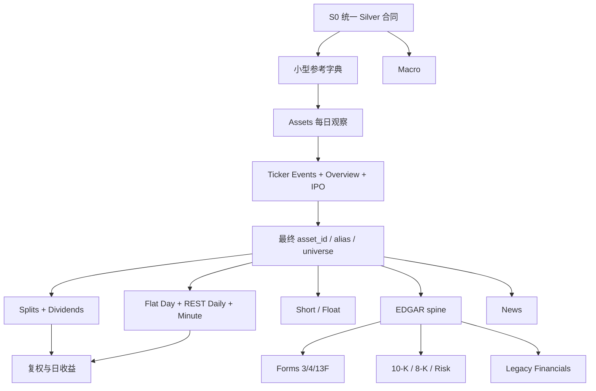

# Ame_Stocks Silver 分数据集处理与逐项验收计划

## 0. 结论、边界与当前状态

Bronze 已具备进入 Silver 的条件。最终 Bronze v9 已证明冻结范围内的下载计划和物理完整性
通过；已知问题属于需要在 Silver 显式处理的 provider 内容差异，而不是本地文件损坏。

本计划覆盖冻结目录中的 **31 个数据集 family（29 REST + 2 Flat Files）**。本文件只定义处理
顺序、输入结构、目标结构、时点规则、QA 和审批门，**不授权运行任何转换、下载或全量任务**。
编号 S1–S34 中，S7、S14、S15 是跨数据集派生审批点；其余 31 项与 31 个 Bronze family
一一对应。

截至 S0 完成后，只能描述为“Silver 控制框架已实现”，不能描述成“Silver 数据已处理”：

- `minute`、`universe` 和 `coverage` 只有 2016-07-11、2021-07-12 两个验证日；
- Ticker Overview lifecycle/safe v2 已全量生成，但仍是 provisional reference，不是最终
  `asset_id` 或完整 PIT 行业表；
- 现有 universe 代码会拒绝单个快照内的重复 ticker，而 Bronze 已知有 214 个 session、
  4,853 组 inactive 版本行，因此当前代码不能直接跑十年全量；
- 复权、最终身份、PIT availability、SEC/财务、新闻和宏观的正式 Silver 转换尚未实现；
- 旧 `ame-materialize`/`ame-flatfiles convert` 仍只生成历史 pilot；正式路径已由独立
  `ame-silver` 合同和 release-only reader 隔离，尚未接入任何 family 转换。

现有 pilot 产物保持不变。正式 Silver 使用新版本路径，不覆盖 pilot，也不修改 Bronze。

## 1. 强制执行节奏：每个数据集单独停下

本文的 Phase 只表示依赖和阅读顺序，**不代表批准一个 Phase 就能连续处理其中全部数据集**。
每个数据集都采用下面两次明确审批：

1. 展示 Bronze 字段、固定样例、目标表、类型、主键、去重和时点规则；此时不跑全量。
2. 用户批准 schema 后，编写该数据集的转换代码和 fixture 测试。
3. 只运行固定小样本，产出 `preview` build。
4. 汇报输入/输出样例、row funnel、quarantine、QA、运行时间、实际体积和全量外推。
5. 用户第二次批准后，才运行该数据集全量转换。
6. 全量 build 状态停在 `awaiting_review`，展示分区、校验和、覆盖率和异常。
7. 用户批准后生成不可变 `published` release；未批准的 build 不供网页或 Gold 使用。
8. 代码和文档单独 Git commit，经 GitHub 快进到远程源码后暂停。
9. 不自动开始下一个数据集。

建议状态流为：

```text
planned → schema_review → code_ready → preview_ready → awaiting_review
        → approved_full_run → full_ready → awaiting_publish → published
```

失败或拒绝的 build 保留证据，不通过覆盖文件或删除异常来“变绿”。

## 2. 正式 Silver 的统一输出合同

### 2.1 版本化目录

建议正式路径为：

```text
/mnt/HC_Volume_106309665/american_stocks/
├── silver/
│   └── schema=v1/
│       ├── reference/<table>/build_id=<digest>/
│       ├── identity/<table>/build_id=<digest>/
│       ├── market/<table>/build_id=<digest>/
│       ├── corporate_actions/<table>/build_id=<digest>/
│       ├── positioning/<table>/build_id=<digest>/
│       ├── sec/<table>/build_id=<digest>/
│       ├── fundamentals/<table>/build_id=<digest>/
│       ├── news/<table>/build_id=<digest>/
│       ├── macro/<table>/build_id=<digest>/
│       ├── quarantine/
│       └── qa/
├── staging/silver/
└── manifests/silver/
    ├── builds/
    └── releases/
```

同一逻辑的新版本写入新的 `schema=vN` 或 `build_id`，不能无痕覆盖。现有
`silver_unadjusted/` 两日 pilot 与 Overview safe v2 作为历史验证证据保留。
网页、Gold 和回测不按目录修改时间寻找“最新文件”，只能读取用户批准的 release manifest
中固定的 table → build_id 映射。

### 2.2 格式与分区

- Canonical 持久化格式为强类型、ZSTD 压缩 Parquet；Pandas、Polars、PyArrow 和 DuckDB
  都可以直接读取。不保存 pickle/Pandas object。
- 分钟线、日线和 universe 按 `session_year/session_date` 分区；通常每交易日一个 Parquet。
- 公司行动按 `execution_year` 或 `ex_dividend_year` 分区。
- SEC/财务按 `filing_year`，新闻按 `published_year`，宏观按 `observation_year` 分区。
- 当前字典/快照按 `capture_date` 和 schema version 保存。
- 不按 ticker、CIK 或 `asset_id` 物理分区，避免大量小文件。
- 单日文件若超过经 pilot 验证的内存安全上限，允许确定性拆成 `part-NNNNN`；不能为了坚持
  “一天一个物理文件”制造 OOM 风险。

### 2.3 Canonical 采用长表

基础类型约定：日期使用 Arrow `Date`，时间戳使用 `Datetime(ns, UTC)`，标识符使用保留大小写的
nullable `String`，价格/比率/允许碎股的 volume 使用 `Float64`，真实整数计数使用 nullable
`Int64`，状态使用 `Boolean` 或有版本的枚举字符串。缺失保持 null，不能用 `0`、空字符串或
`unknown` 偷换。会参与研究 join 的数组（ticker、manager、data type 等）拆成 bridge 表；只有
不参加行级研究的复杂规则对象才允许以稳定 JSON 保留。

分钟行情永久保存为 long format：

```text
session_date, bar_start_utc, asset_id, ticker_at_source,
session_segment, open, high, low, close, volume, transactions
```

不永久保存成“一只股票一行、390 个分钟槽展开成数百列”的宽表。半日市只有约 210 个 RTH
分钟，停牌、无成交、盘前盘后和 DST 也会使宽表 schema 不稳定。页面或研究代码需要矩阵时，
再对选定日期、股票池和字段临时 pivot。

日线是一日一证券一行的 long panel：

```text
session_date, asset_id, price_source,
open, high, low, close, volume, transactions, vwap
```

### 2.4 永久身份

```text
asset_master(
  asset_id, issuer_id, composite_figi, share_class_figi,
  security_type, resolution_status,
  first_seen_session, last_seen_session
)

ticker_alias(
  asset_id, ticker,
  valid_from_session, valid_to_session,
  evidence_type, confidence, source_record_id
)

issuer_master(
  issuer_id, cik, legal_name, resolution_status
)
```

- ticker 永远不是永久主键，且必须保留 provider 原始大小写。
- `asset_id` 表示可交易证券，优先由 Composite FIGI 使用固定 namespace 的 UUIDv5
  确定性生成；缺 FIGI 时只能生成带 `provisional` 状态的确定性内部 ID。
- `issuer_id` 表示发行人，可由规范化 CIK 确定性生成；CIK 不能代替 `asset_id`。
- ticker alias 使用半开区间 `[valid_from_session, valid_to_session)`。
- 身份修复通过新映射和新 release 发布，不静默改写历史 ID。

### 2.5 时间与回测可用性

禁止使用含义模糊的单一 `date`。根据数据类型保留：

```text
session_date
bar_start_utc
event_date / event_at_utc
period_start / period_end
filing_date / filing_at_utc
published_at_utc
available_at_utc
available_session
source_capture_at_utc
availability_rule
availability_quality
```

- 时间戳统一为 UTC aware；纽约时间只用于派生 session、RTH 和 cutoff。
- date-only filing/disclosure 默认该日收盘后公开，因此下一交易日才可进入日频信号。
- `period_end`、settlement date、transaction date 都不能替代 `available_session`。
- 当前快照只能在 capture date 以后使用。
- 没有历史 release/vintage 的宏观数据标记 `revised_history=true`、`pit_eligible=false`。

### 2.6 Lineage、quarantine 和 QA

每个 build manifest 至少保存：

```text
build_id, schema_version, transform_version, git_commit,
exchange_calendar_version, input_manifest_paths_and_sha256,
source_digest, parameters, row_funnel,
output_paths_and_sha256, started_at, completed_at,
qa_summary, approval_status
```

Flat File 可使用文件级 lineage，避免在数十亿分钟行中重复长路径。REST 合并、去重和 SEC
表按需要增加：

```text
source_artifact_id, source_request_id,
source_page_sequence, source_row_ordinal, source_row_hash
```

Quarantine 是 append-only 正式输出：

```text
source_record_id, table_name, issue_code, severity,
detected_build_id, source_pointer, field_name,
observed_value, expected_rule, review_status
```

Data Health 的统一检查结果为：

```text
build_id, table_name, partition_key, check_id,
severity, status, numerator, denominator, rate,
threshold, bounded_examples_path
```

每类至少展示 Bronze 输入行、Silver 接受行、精确重复 excess、quarantine、身份未解析、主键
重复、null、日期范围、输入输出 SHA 和同输入重跑 checksum。

### 2.7 磁盘和运行保护

- 每个 preview 必须实测输出压缩率、运行内存、临时峰值和耗时，再外推该数据集全量。
- 数据盘剩余空间低于 60 GiB 时预警；预计任务会让剩余空间低于 40 GiB 时拒绝启动。
- 不通过删除 Bronze、旧项目、旧 Docker Volume 或审计证据腾空间。
- preview 只写 `staging/silver`；用户批准 full build 后才写正式 versioned Silver 路径。
- 所有临时文件完成 fsync、hash、schema 和 row-count 校验后才原子发布。
- 任何一个数据集运行期间都不并发启动另一个未经批准的 Silver family。

## 3. 以量化后续处理为优先的明确取舍

| 可能的直觉或早期偏好 | 正式选择 | 原因 |
| --- | --- | --- |
| 每日文件中一行一股票、分钟为数百列 | 每日物理分区仍保留，但 canonical 是 sparse long table | 半日市、停牌、无成交和盘前盘后不会改变 schema；更适合 Parquet 增量扫描 |
| 保存成 Pandas 文件/pickle | 保存 Parquet，Pandas 用 `read_parquet()` | 类型明确、压缩好、跨语言、支持列裁剪，长期比 pickle 稳定 |
| ticker 直接作为股票主键 | `asset_id` + 有效期 ticker alias | ticker 会变化、复用且大小写有语义 |
| inactive 每日只保留一个 ticker 行 | 所有版本保留为证据，先解析身份再选研究行 | 同 ticker 可能代表不同历史证券；粗暴去重会产生身份错误 |
| 三套日线清洗成一套并覆盖差异 | Flat Day、REST Daily、minute-derived RTH 永久分源保存 | 三个产品的交易时段和 condition update 规则不同 |
| 缺分钟补 0 或前值 | 保持稀疏，另存 missing/停牌/无成交/源缺失状态 | 虚构 bar 会污染成交价、波动率和流动性 |
| 一个 `adjusted_close` 足够 | 保存 raw、事件、link return、split/total-return 明确口径和版本 | 防止双重复权和锚定日期变化 |
| 财务指标全部 pivot 成 filing-wide | Silver metric-long，Gold 对常用 allowlist 再 pivot | 指标稀疏、单位/来源/版本复杂，长表更适合 PIT 和 provenance |
| 稀疏事件也按每天建文件 | 公司行动/SEC/新闻主要按年度分区 | 避免大量空分区和小文件 |
| 当前 Float、Overview 市值/SIC 可补历史 | 禁止历史回填 | 会产生未来信息；SIC 也不是完整 PIT 行业史 |
| 13-F 没有 holdings 就当 0 | `holdings_status=not_public_or_unavailable` | 无明细不等于零持仓 |
| 清洗就是删除异常 | 异常进入带 lineage 的 quarantine | Bronze 不变，所有排除必须可审计 |

## 4. 依赖顺序



完成身份、行情、公司行动和复权后即可先做价格型日频因子；不必等待 SEC、新闻和宏观全部
完成。Classic Barra 的历史 shares/market cap 和完整 PIT industry 仍是数据源限制，不能由
Silver 清洗自动创造。

## 5. Phase 0：共同合同，只建框架不处理数据

### S0 — Silver schema、preview 和 publish 框架

**状态（2026-07-12）：已获批准、实现并验收。** 实现只在临时合成 fixture 上
验证，没有读取 Bronze、没有写远程数据盘、没有生成 preview/full 真实数据。详细冻结合同见
[`silver-s0-contracts.md`](silver-s0-contracts.md)。当前已经具备：

- schema/QARule registry、SourceInventory/source layer 和完整 lineage；
- 不可变 build/approval/release manifest 与 hash-chain workflow；
- QA/sample/quarantine Parquet 对账，以及 Critical/High 审批门；
- 只接受已发布 release ID 的公开 reader；
- `ame-silver fixed-cases/validate-contract/status/inspect-release` 四个只读检查命令。

S0 完成本身不授权 S1；`exchanges` schema 已于 2026-07-13 另行获得精确 contract 批准。

- 输入：无数据转换；只读取已有 schema、manifest 和 fixture。
- 输出：schema registry、build/release manifest、quarantine contract、QA contract、preview
  展示格式和固定案例清单。
- 必须补齐：`preview → awaiting_review → published` 状态；现有 CLI 不能再直接把新正式产物
  写成“已完成”。
- 固定案例：正常日、半日市、current-only reference snapshot、2:1 split、reverse split、
  普通/特殊分红、停牌/缺分钟、ticker change、ticker reuse、退市、大小写相近 ticker、
  2019-08-12 异常、date-only filing、13-F header-only。
- 验收：不接触全量数据；使用 fixture 证明 schema、原子写、幂等、lineage 和审批状态。

S0 与 S1 schema approval 均已通过；第一类实际 preview 仍从 `exchanges` 开始。

## 6. Phase 1：小型参考字典

### S1 — `exchanges`

**状态（2026-07-13）：Phase 1 / `code_ready`。** 用户已批准精确 contract
`1803d28f2b4b6088e32d27d06c7102111e4f141b6645a1059829732442f0e479`；已完成
[`exchange_dim` schema 与 code-ready 实现](silver-s1-exchanges-schema-review.md)，包括
manifest-bound reader、纯转换、20 项 QA、quarantine、row funnel 和第 15 个 fixed case。尚未
运行真实 Bronze preview、full build 或 publish。

- Bronze：当前快照，一行一个场所；主要字段为 `id, name, acronym, mic, operating_mic,
  participant_id, type, asset_class, locale, url`。
- Silver：`reference/exchange_dim`，粒度为 `(capture_date, exchange_id)`；保留 MIC、场所类型和
  snapshot lineage。
- 处理：强类型化 MIC/ID，不把今天的字典伪装成历史交易所成员表。
- QA：`id` 唯一、MIC 冲突、asset class/locale 合法、后续 `assets.primary_exchange` 覆盖率。
- 建议 pilot：全部 27 行即可，但仍先展示 schema、再获批写正式 build。

### S2 — `ticker_types`

- Bronze：当前快照，一行一个类型；`asset_class, locale, code, description`。
- Silver：`reference/ticker_type_dim`，粒度 `(capture_date, asset_class, locale, type_code)`。
- 处理：保留 provider code，不提前把类型粗分成 common stock/ETF；研究 eligibility 另有版本。
- QA：候选键唯一、空 description、能否解码 `assets.type`、新增/消失代码。

### S3 — `condition_codes`

- Bronze：当前快照；`id, name, type, asset_class, data_types[], exchange, legacy,
  sip_mapping, update_rules`。
- Silver：`reference/condition_code_dim` 与 `condition_code_data_type_bridge`；数组展开后每行一个
  data type，保留 current/legacy 和 SIP/update rule JSON。
- 处理：不能按 `(asset_class, data_type, id)` 静默覆盖 legacy 版本。
- QA：数组/domain、当前/legacy 歧义、exchange 外键、SIP mapping/update rules 可解析。
- 用途：解释 provider aggregate 差异；没有逐笔数据时不声称能反推每笔 eligible trade。

## 7. Phase 2：每日股票池和永久身份

### S4 — `assets` active + inactive

- Bronze：查询日 × active 参数 × ticker；主要字段为 `active, ticker, type, name, market,
  locale, primary_exchange, currency_name, cik, composite_figi, share_class_figi,
  delisted_utc, last_updated_utc`。
- Silver 输出：
  - `identity/asset_observation_daily`：保留每个 source observation；
  - `identity/asset_observation_version`：重复版本和选择证据；
  - `reference/universe_source_daily`：研究用的一日一 source identity 观察，`asset_id` 可暂为
    provisional，并保存 `identity_link_status`。
- 处理：active/inactive 合并；4,853 组 inactive 重复不能随便取第一行。候选选择规则应基于
  `last_updated_utc`、`delisted_utc`、身份字段和稳定 row hash，并把所有 rejected version
  留在版本表；规则必须经样例批准。
- QA：active/inactive 交集为 0、每日行数、重复组 funnel、case-sensitive ticker、类型/交易所
  覆盖、同日 FIGI/CIK 冲突。
- 阻塞说明：现有 materializer 遇到这些重复会报错；必须先改代码，不能直接跑十年。

### S5 — `ticker_events`

- Bronze：每个 identifier 一条事件时间线；`results.name/cik/composite_figi/events[]`，事件含
  `date, type, ticker_change.ticker`；另有稳定 404 receipts。
- Silver：`identity/ticker_change_event`、`identity/ticker_event_request_status`、
  `quarantine/ticker_event`。
- 处理：展开 `events[]`；正式 3,702 个 404 和 84 个 pilot 404 记录为 coverage/status，不当成
  每日 universe 漏失；193 个空 target placeholder 隔离，但保留同响应合法事件。
- QA：事件键、前后 ticker 与 Assets 时间线、FIGI 一致性、空 target、同日多事件和修订。

### S6 — `ticker_overview`

- Bronze：每个 deduplicated identity lifecycle 查询一次；身份、SIC、list date，以及不安全的
  current-looking market cap/shares 字段。
- Silver：`identity/ticker_overview_safe`，粒度为一 lifecycle；固定 allowlist 包含生命周期、
  身份校验、SIC、list date 和 reference 字段。
- 处理：现有 safe v2 可作为 review 输入；正式 release 不自动重下。`market_cap`、
  `weighted_shares_outstanding`、`share_class_shares_outstanding` 永远不进入第一阶段历史表。
- QA：30,570/30,739 identity match；169 行隔离/人工复核；`list_date <= query_date`；SIC/list
  date coverage；不得把 safe SIC 描述成完整 PIT industry。

### S7 — 派生 `asset_master` / `ticker_alias` / `issuer_master`

这不是新的 Bronze 数据集，必须在 S4–S6 分别验收后单独审批：

- 综合 Assets、Ticker Events 和 Overview 身份证据；
- 生成确定性 `asset_id`、`issuer_id` 和 ticker 有效区间；
- 生成 `reference/universe_daily`，以每个信号日的 active snapshot 为左表，附最终
  `asset_id`、身份状态、security type 和版本选择 lineage；
- 同 ticker 不同 FIGI 拆成不同资产，同 FIGI 的非重叠 ticker 生命周期才可候选合并；
- 仅凭名字、ticker root 或相同 CIK 不自动合并 share class；
- 输出 identity coverage、conflict、provisional 和人工 review 清单。

### S8 — `ipos`

- Bronze：一个 provider IPO/DPO 事件版本；`ticker, issuer_name, announced_date, listing_date,
  last_updated, ipo_status, offer prices, shares, offer size, exchange, security identifiers`。
- Silver：`corporate_actions/ipo_event_version` 与 `identity/asset_listing_event`；无 provider ID 时
  使用规范化 row hash，保留修订版本。
- 处理：`listing_date` 可用于上市年龄；今天看到的 rumor/pending/final 状态不能假装成历史
  每日 PIT 状态。
- QA：asset link、listing date 与首次 active/首个 bar、状态 domain、重复 hash、异常日期顺序。

## 8. Phase 3：公司行动

### S9 — `splits`

- Bronze：一行一次事件；`id, ticker, execution_date, adjustment_type, split_from, split_to,
  historical_adjustment_factor`。
- Silver：`corporate_actions/split_event`；包含 `asset_id, execution_date,
  split_ratio_new_per_old, provider_historical_factor, event_factor, source lineage`。
- 处理：事件 ratio 从 `split_from/split_to` 独立计算；provider 累计因子只作 QA，不能再当事件
  ratio 连乘。
- QA：正数比例、同日多事件顺序、asset link、2:1/reverse/stock dividend 手算、拆股前后价格
  与 volume/shares 方向相反。

### S10 — `dividends`

- Bronze：一行一次现金事件；`id, ticker, cash_amount, split_adjusted_cash_amount, currency,
  declaration_date, ex_dividend_date, record_date, pay_date, frequency, distribution_type,
  historical_adjustment_factor`。
- Silver：`corporate_actions/dividend_event`，分开保存 raw cash 与 current-share-basis cash。
- 处理：总收益按 ex-date；公告因子只能在 declaration date 后；币种未转换时不能直接加入 USD
  收益；special/irregular 不当普通季度分红。
- QA：日期顺序、币种、金额、重复、split chain 一致性、普通和特殊分红手算。

## 9. Phase 4：三套未复权行情

### S11 — `day_aggregates`

- Bronze：每日 gzip CSV，一行 ticker-session；`ticker, volume, open, close, high, low,
  window_start(ns), transactions`。
- Silver：`market/provider_day_flat/session_date=.../bars.parquet`；粒度
  `(session_date, asset_id)`，保留 `ticker_at_source`、raw OHLCV、timestamp status 和 QA flags。
- 处理：ns → UTC/ET/session；连接 `asset_id`；不复权、不覆盖其他日线。
- QA：主键、OHLC 不变量、有限/非负、日期归属、identity coverage；2019-08-12 的 29 个
  非规范 timestamp 进入 quarantine/flag，不静默修正。
- 现状：现有通用 Flat converter 没有独立 Day 单测，也不会隔离上述 29 行；正式 schema 需新版本。

### S12 — `daily_bars` REST Daily Market Summary

- Bronze：请求交易日 × ticker；`T, o, h, l, c, v, vw?, n?, t, otc?`，外壳含
  `adjusted, queryCount, resultsCount`。
- Silver：`market/provider_daily_rest/session_date=.../bars.parquet`，保留
  `requested_session_date, provider_window_end_utc, exchange_close_utc, vw, transactions` 及
  missing flags。
- 处理：`vw/n/otc/results` 均按官方 optional 合同；`t` 是名义 16:00 ET，不是半日市真实
  close/available time；2016-07-11/12 是 entitlement 缺口，不造假行。
- QA：外壳 count、OHLC、OTC=false、时间合同、字段 missing、与 Flat Day 的 coverage/numeric
  difference。差异只进 QA，不互相覆盖。

### S13 — `minute_aggregates`

- Bronze：每日 gzip CSV，一行 ticker × 有合格成交的分钟，字段与 Flat Day 相同。
- Silver：`market/minute_unadjusted/session_date=.../bars.parquet`；粒度
  `(session_date, asset_id, bar_start_utc)`；增加 `ticker_at_source, session_segment,
  is_half_day, minute_index, identity_link_status, qa_flags`。
- 处理：保留稀疏 bar；标记 pre/RTH/post/outside；不填满 390/210 行、不把 null 写 0、不前填
  成真实成交；按 `asset_id, bar_start_utc` 排序。
- QA：源键和身份后键、OHLC、非负 volume/transactions、文件日期、DST、RTH/半日市边界、
  重复差异、每日 ticker/rows/volume 分布。
- 资源规则：先用正常日和半日市测内存、时间、压缩比和临时峰值，再决定 Polars lazy/batched
  实现。现有代码是整日 `read_csv`，不能在计划中声称已真正 streaming。
- 全量硬停点：45.51 GB Bronze minute 只能在 pilot 报告和磁盘外推获批后运行。

### S14 — 派生 coverage、RTH 日线和执行代理

在 S11–S13 分别验收后，另行审批以下非 Bronze 产物：

- `market/market_coverage_daily`：active-without-bars、inactive-with-bars、bars-without-reference、
  minute/RTH minute count；
- `market/daily_rth_from_minute`：按真实交易日历聚合的 RTH OHLCV；
- `market/open_30m_execution_proxy`：对 `[09:30, 10:00)` ET 内有 bar 的分钟计算
  `sum(minute_close * minute_volume) / sum(minute_volume)`，明确命名
  `minute_close_vwap_proxy`，不能标成真实 VWAP；无足够窗口数据时输出 unavailable，不用全天
  VWAP 或未来分钟替代。

Flat Day、REST Daily、minute-derived RTH 永久使用不同 `price_source`。Canonical selection 或
fallback 需要单独 policy 和审批，保存 `selected_source/fallback_reason`。

### S15 — 派生复权、日收益和总收益

在 S9–S14 通过后单独审批：

```text
market/daily_adjustment_factor
market/daily_return
```

核心字段：

```text
asset_id, session_date, price_source,
split_factor, dividend_cash, currency,
close_raw, return_price, return_total,
return_status, adjustment_version
```

优先保存逐日 link return，而不是只有一个随最新 anchor 变化的 `adjusted_close`。如需复权价格
曲线，必须显式保存 `anchor_date`。分钟数据默认不复制一份 adjusted 全量表；按需连接每日因子，
避免重复占用数十 GB。

## 10. Phase 5：做空与当前截面

### S16 — `short_volume`

- Bronze：ticker-date；short/exempt/non-exempt/total volume、ratio 和 venue 分项。
- Silver：`positioning/short_volume_daily`；粒度 `(session_date, asset_id)`，保存 coverage scope
  和 `available_session=next_session` 的版本化规则。
- 处理：重算 short volume、exempt/non-exempt 和 ratio；不强制等于 SIP 总成交量。
- QA：分项加总、ratio、非负、asset join、日期连续性和 2024-02-06 覆盖起点。

### S17 — `short_interest`

- Bronze：ticker-settlement date；`short_interest, avg_daily_volume, days_to_cover`。
- Silver：`positioning/short_interest_observation`；增加 `release_date, available_at,
  available_session, availability_status, pit_eligible`。
- 处理：重算 days-to-cover；settlement date 不能直接当可用日。
- QA：数值关系、双周节奏、asset join、重复和 release lag。
- 硬限制：在 FINRA release calendar 或保守 lag policy 单独获批前，`pit_eligible=false`。

### S18 — `float`

- Bronze：最新 ticker-effective-date 截面；`free_float, free_float_percent`。
- Silver：`reference/current_float_snapshot`，粒度 `(capture_date, asset_id)`；仅当前展示/方法 QA。
- 处理：不能展开为十年日表，不能进入历史 Size/Turnover；一行缺 ticker 进入 quarantine。
- QA：asset coverage、百分比范围、重复、effective/capture date、历史 join 防护测试。

## 11. Phase 6：SEC spine、所有权、文本和财务

所有 SEC 表都依赖 `edgar_index` 的 filing spine。修订 filing 保留版本/lineage，不无痕覆盖。

### S19 — `edgar_index`

- Bronze：accession × registrant/CIK metadata；`accession_number, cik, ticker, issuer_name,
  form_type, filing_date, filing_url`。
- Silver：`sec/filing_header` 与 `sec/filing_registrant`；同 accession 可有多个合法 registrant。
- 处理：规范整行 hash 去除 22,032 个精确重复 excess；6,148 个候选 metadata 版本保留版本
  证据；不能按 accession 单键删掉联合申报 CIK。
- QA：候选键、exact duplicate funnel、filing date/form/url、CIK 格式和后续 endpoint accession
  coverage。

### S20 — `disclosure_taxonomy`

- Bronze：当前快照；119 行三级 disclosure 分类和 description。
- Silver：`reference/disclosure_taxonomy_dim`，粒度 `(capture_date, taxonomy_version, 三级路径)`。
- QA：路径唯一、版本/capture date、所有 8-K disclosure 类别覆盖；不声称 taxonomy 历史不变。

### S21 — `risk_taxonomy`

- Bronze：当前快照；140 行三级风险分类。
- Silver：`reference/risk_taxonomy_dim`，粒度 `(capture_date, taxonomy_version, 三级路径)`。
- QA：候选键、描述、所有 risk factor 类别覆盖；当前 taxonomy 不回填为历史版本事实。

### S22 — `form_3`

- Bronze：filing 被拆成证券/持仓行；含 filing、issuer、owner、security、shares、footnotes。
- Silver：`sec/form3_filing`、`sec/form3_position_line`、可选 footnote child table。
- 处理：filing header 与行事实分离；整行 hash；保留修订、直接/间接持有和脚注。
- QA：EDGAR accession/date/issuer、行级重复、owner/security domain、shares、amendment lineage。

### S23 — `form_4`

- Bronze：filing 下 transaction/holding 行；含 transaction code/date、A/D、price、shares、
  security type、post-transaction holdings 和 footnotes。
- Silver：`sec/form4_filing`、`sec/form4_transaction_line`、`sec/form4_holding_line`、footnotes。
- 处理：交易方向不能只看 transaction code，必须结合 A/D、record/security type、脚注和修订。
- QA：EDGAR、transaction value 重算、买卖符号手算、holding/transaction 分离、迟报和修订。

### S24 — `form_13f`

- Bronze：filing metadata 或 information-table holding；含 accession/filer/period/CUSIP/value/
  shares/put-call/discretion/voting。
- Silver：`sec/form13f_filing`、`sec/form13f_holding`、`sec/form13f_manager_bridge`、
  `sec/ownership_asset_link`。
- 处理：152 条 header-only 保留在 filing header，设置
  `holdings_status=not_public_or_unavailable`，不写入 holding、不解释为 0；HR/A replacement/
  addition policy 单独审批；额外 3,396,312 行 audit pilot 永远不混入正式 41 季权威输入。
- QA：EDGAR、holding 完整/整组缺失、数值/domain、CUSIP/asset link confidence、quarter end 与
  filing availability、amendment。
- 全量硬停点：正式 13-F 超过一亿行，先用一个季度测内存、存储和 join 规则。

### S25 — `ten_k_sections`

- Bronze：CIK × filing date × section；`ticker, period_end, section, text, filing_url`。
- Silver：`sec/ten_k_document` 与 `sec/ten_k_section_text`，metadata 和长文本分离。
- 处理：确定性 Unicode/空白规范化、content hash、版本保留；情绪/embedding 属于 Gold。
- QA：EDGAR/CIK、section domain、正文 hash/version、9,910 个候选版本和 8 个精确重复处理、
  `available_session` 不使用 period end。

### S26 — `eight_k_text`

- Bronze：一份 8-K/8-K-A 解析正文；`accession, cik, ticker, form_type, filing_date,
  items_text, filing_url`。
- Silver：`sec/eight_k_document` 与 text payload；修订作为独立版本。
- QA：EDGAR accession/date/CIK、正文 hash、1 个精确重复 excess、空文本和 amendment lineage。

### S27 — `eight_k_disclosures`

- Bronze：filing × 三级分类 × supporting text；同 accession 可多分类、多 ticker；2022 前成功
  空响应。
- Silver：`sec/eight_k_disclosure_fact`、`sec/disclosure_ticker_bridge`、supporting text payload。
- 处理：按 filing identity + taxonomy + text hash；展开 ticker bridge；2016–2021 标为 provider
  coverage unavailable，不解释成零事件；pilot 永远非权威。
- QA：EDGAR、taxonomy 100% decode、row hash、ticker/asset link、coverage boundary、日期和修订。

### S28 — `risk_factors`

- Bronze：CIK/filing date × 三级风险类别 × supporting text。
- Silver：`sec/risk_factor_fact`、text payload 和 taxonomy link。
- 处理：规范整行 hash 去除 30,449 个精确重复 excess；无可靠 accession 时显式保存 linkage
  confidence，不能猜 filing。
- QA：taxonomy、CIK/asset、正文 hash、candidate versions、filing availability 和重复 funnel。

### S29 — `legacy_financials`

- Bronze：377,576 个 report rows，内部有 18,124,688 个
  `financials.<statement>.<metric>`；根字段含 CIK、period、filing/acceptance、timeframe、SIC、
  tickers 和 accession URL；metric 含 value/unit/source 及 xpath/formula/derived_from。
- Silver：
  - `fundamentals/financial_report_header`；
  - `fundamentals/financial_metric_long`；
  - `fundamentals/metric_derivation_bridge`；
  - `fundamentals/financial_ticker_bridge`；
  - `quarantine/legacy_financials`。
- 处理：metric-long 保存 `statement, metric_name, value_f64, unit, provenance_method, xpath,
  formula`；direct/imputed/derived 分层；所有 `derived_from` filing 必须当时已公开。
- QA：39 条 `end_date > filing_date` hard quarantine、2 条 EDGAR 日期差异、492 行/480 accession
  EDGAR coverage gap、acceptance、CIK、unit/value、重复 ticker array、空 SIC、derived lineage。
- 硬限制：这是 legacy fallback；没有 PIT shares/market cap 时，不能据此宣称 classic Barra
  基本面/Size 已完整。常用 metric-wide 表只能在 Gold 用固定 allowlist 另行审批。

## 12. Phase 7：新闻

### S30 — `news`

- Bronze：一篇 article；`id, title, description, author, published_utc, article_url, publisher,
  tickers[], keywords[], insights[]`。
- Silver：`news/article`、`news/article_ticker_bridge`、`news/article_insight`、publisher dimension；
  文章正文/描述只存一次。
- 处理：published UTC → ET/session；多 ticker 和 insight 展开；保留 canonical URL、content hash、
  修订/聚合来源和 asset mapping status；模型 sentiment/embedding 属于 Gold。
- QA：article ID/URL/hash、时间、syndication/重复、ticker link、insight domain、公开网站许可边界。

## 13. Phase 8：宏观数据

四类数据统一规范为：

```text
macro/observation(
  series_id, observation_date, value, unit, source_dataset,
  published_at_utc, available_session, capture_date,
  revised_history, pit_eligible, availability_rule
)
```

Provider 的宽行可保留为 source projection，但正式研究表拆成长 series，因为同一响应中的字段
频率、开始日期和发布时间不同。

### S31 — `treasury_yields`

- Bronze：date + 1m/3m/6m/1y/2y/3y/5y/7y/10y/20y/30y yields。
- Silver：每个 tenor 一条 `series_id` observation。
- QA：期限 domain、百分比单位、自然缺失、曲线覆盖起点；不存在的历史 tenor 不补 0/前值。
- PIT：release/availability policy 获批前不假设 observation date 当日盘前已知。

### S32 — `inflation`

- Bronze：date + CPI/core/同比/PCE/core/PCE spending。
- Silver：每个指标独立 series，保存频率、单位和 availability status。
- QA：频率、单位、值域、系列起点、缺失和修订；不同字段不能因在同一 row 就假设同刻发布。
- PIT：无 release/vintage 补充前 `pit_eligible=false`。

### S33 — `inflation_expectations`

- Bronze：date + 5y/10y breakeven、5y5y forward、模型 1/5/10/30y。
- Silver：市场 series 与模型 series 分开。
- QA：单位、期限、缺失、系列起点和不同生成时点；不混合市场与模型 availability。
- PIT：每类 release rule 单独审批。

### S34 — `labor_market`

- Bronze：date + unemployment、participation、hourly earnings、job openings。
- Silver：每个指标独立 series。
- QA：频率/单位、自然缺失、序列诞生时间、值域和修订；不向序列开始前回填。
- PIT：没有 release/vintage 历史时只允许展示或非 PIT 实验。

## 14. 每个数据集的统一验收包

每次 preview 和 full build 都必须向用户展示：

1. Bronze 实际样例外壳与 5–20 条有界样例，不泄露 API Key；
2. 输入字段 → Silver 字段映射表；
3. 输出 Parquet schema、主键、分区和排序；
4. 输入、接受、精确重复、版本保留、quarantine、未映射行的 row funnel；
5. null、duplicate、domain、日期、identity、availability 和 referential-integrity QA；
6. 正常与异常样例的前后对比；
7. 输出文件、manifest、SHA-256、代码 commit 和 transform/schema version；
8. 实际运行时间、压缩比、输出体积、临时峰值和全量外推；
9. Data Health 将展示的指标和 bounded examples；
10. 明确列出哪些列 `research_eligible=true/false` 及原因。

Critical 问题（checksum、manifest、主键、未来数据、双重复权）立即停止；High 问题进入
quarantine 并等待人工 review；Medium/Low 保留标志，不能从分母中静默删除。

## 15. 推荐的下一步

本计划通过后仍不直接处理行情。推荐顺序是：

1. 先单独批准 **S0 Silver 合同和审批框架**；
2. S0 验收后，单独批准 **S1 `exchanges`**，用 27 行小字典验证完整 preview/review/publish
   生命周期；
3. 每完成一类就暂停，由用户决定是否进入下一类。

当 S4–S15（身份、公司行动、三套行情、复权和收益）完成并发布后，price-derived Barra 和
普通日频因子即可开始；S16–S34 可以继续逐项扩充，不应阻塞第一批价格型因子。

## 16. 相关证据和字段字典

- [Bronze 全面审计](bronze-audit-2026-07-12.md)
- [完整 Bronze 字段字典](../DATA_README.md)
- [数据处理护栏与时点规则](massive-data-processing-guardrails.md)
- [Massive research catalog](massive-research-catalog.md)
- [Downloader 与存储说明](massive-downloader.md)
